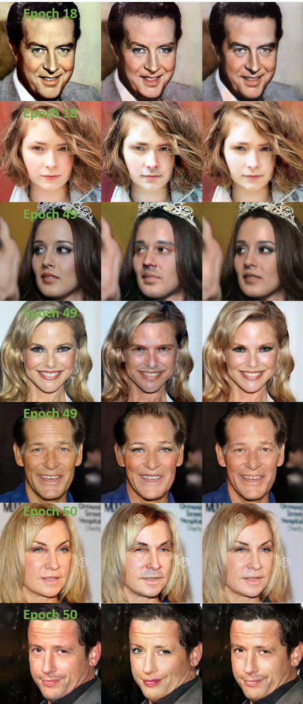

# StarGAN_Pytorch (2018 CVPR) 

This repository provides gender image to image translation (female <-> male) by using Pytorch Version of StarGAN in the <b>CelebA-HQ Dataset</b>.

[[StarGAN - Official Pytorch Implementation]](https://github.com/yunjey/stargan)

[[Official Paper]](https://openaccess.thecvf.com/content_cvpr_2018/papers/Choi_StarGAN_Unified_Generative_CVPR_2018_paper.pdf) [[Arxiv]](https://arxiv.org/abs/1711.09020)

Paper Review : https://aigong.tistory.com/395

Another GAN implementation code (DCGAN, WGAN, WGAN-GP, BEGAN, CycleGAN, SNGAN, SAGAN) : https://github.com/stellaluminary/Pytorch-GAN-implementation

## Dependencies

* Python 3.6+
* PyTorch 1.4+
* Numpy
* Yaml
* Logging

## Downloading CelebA-HQ Dataset

To download the [[CelebA-HQ]](https://drive.google.com/drive/folders/0B4qLcYyJmiz0TXY1NG02bzZVRGs?resourcekey=0-arAVTUfW9KRhN-irJchVKQ) dataset, run the following commands

Well-organized CelebA-HQ dataset exists in stargan v2 Official github so some modifications have been done and copied to this repository.
[[StarGAN-v2 - Official Pytorch Implementation]](https://github.com/clovaai/stargan-v2)


```
bash download.sh celeba-hq-dataset
```

CelebA-HQ Dataset Organization

```
./data
└── celeba_hq (# 30,000)                   
    ├── train (# 28,000)
    |   ├── female (# 17,943)
    |   |   ├── 000004.jpg
    |   |   ├── 000009.jpg
    |   |   ├── ...
    |   |   └── 202591.jpg
    |   └── male (# 10,057)
    |   |   ├── 000016.jpg
    |   |   ├── 000025.jpg
    |   |   ├── ...
    |   |   └── 202362.jpg
    └── val (# 2,000)
        ├── female (# 1,000)
        └── male (# 1,000)
```

## (Optional) Save the Resize Dataset

Becuase of the limitation of GPU memory, if necessary, need to resize the dataset image size.

In this repository, torchvision.transform.resize will be done whether run this code. 

So this is optional to perform this code 

```
python prepare_dataset.py --source ./data/celeba_hq --img_size 256
```

## Configuration

Unlike other repository implementation code, this repository use yaml file for configuration.

So if you want to change the model configuration, check and modify in the configs/stargan.yaml file.

Necessary check configuration

* Setting: gpu_ids (how many and which gpus will you use)
* Path: Data_train, Data_val (location of train dataset/ validation dataset)
* Model_Param: img_size (resize img_size)
* Data_Param: batch_size
* Train: n_epochs
* Save: save_img_iter(save the image per iteration), print_iter (logging and print the dataset loss per iteration)

## Training from scratch

After check and modify the configuration in configs/stargan.yaml, run the following commands

```
python train.py --opt configs/stargan.yaml
```

## Test

After check and modify the configuration in configs/stargan.yaml, run the following commands

Setting: phase : test


```
python test.py --opt configs/stargan.yaml
```


## Results

|256x256 / batch_size 4 / epoch 50 / NVIDIA RTX 2060 6GB|
||
|:---:|
||


